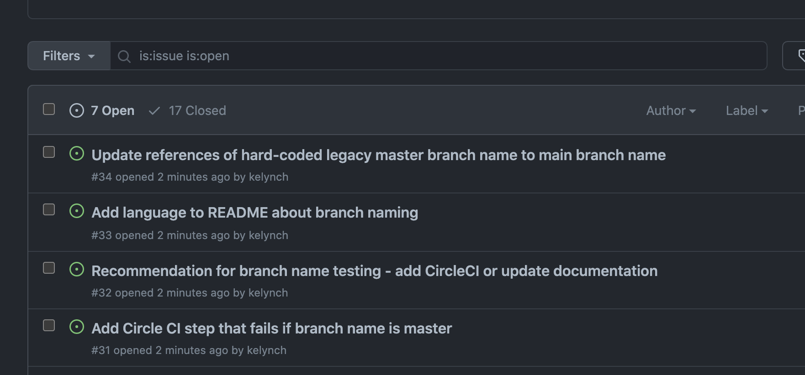

# README for `branch_renaming_change_process`

This repository contains a script for adding issues to GitHub repositories as part of the [Samvera Branch Renaming Group's](https://samvera.atlassian.net/wiki/spaces/samvera/pages/504926829/Samvera%2BBranch%2BRenaming%2BWorking%2BGroup) change process. Visit the Samvera wiki to learn more about the group and our process.

## Requirements
* [Git](http://git-scm.com/)
* [GitHub](http://github.com/) account
* [GitHub CLI](https://cli.github.com/manual/installation)

## Installation and Use

1. To install, first clone the repository:

  ```bash
  $ git clone git@github.com:kelynch/branch_renaming_change_process.git
  $ cd branch_renaming_change_process
  ```
2. [Authenticate to the GitHub CLI](https://cli.github.com/manual/gh_auth_login) with your GitHub account:
  ```bash
  $ gh auth login
  ```

3. Once authenticated, you are ready to use the script:
  ```bash
  $ ./create.sh
  ```

4. You will be prompted to provide URL of the GitHub repository you are working on.  Type the full URL at the prompt, then hit `Enter`.

  ```bash
  $ ./create.sh
  Specify a repository in "[HOST/]OWNER/REPO" format

  $ https://github.com/myUser/repositoryName

  ```

5. You will be prompted to enter the number of each issue you wish to open for the specified repository.  Enter the number for each issue on one line, and hit `Enter`.

  ```bash
  Enter 1, 2, 3, and/or 4 to open the following issue(s) [example: 1, 24, 1234]:

  [1] Add Circle CI step that fails if branch name is master
  [2] Recommendation for branch name testing - add CircleCI or update documentation
  [3] Add language to README about branch naming
  [4] Update references of hard-coded legacy master branch name to main branch name

  ```

6. You will see output for each issue successfully created:

  ```bash
  ...
  [4] Update references of hard-coded legacy master branch name to main branch name
  $ 1234

  Add Circle CI step that fails if branch name is master

  Creating issue in myUser/repositoryName

  https://github.com/myUser/repositoryName/issues/31
  Recommendation for branch name testing - add CircleCI or update documentation

  Creating issue in myUser/repositoryName

  https://github.com/myUser/repositoryName/issues/32
  Add language to README about branch naming

  Creating issue in myUser/repositoryName

  https://github.com/myUser/repositoryName/issues/33
  Update references of hard-coded legacy master branch name to main branch name

  Creating issue in myUser/repositoryName

  https://github.com/myUser/repositoryName/issues/34
  ```

7. You should be able to see your issues in the browser, example:
  
